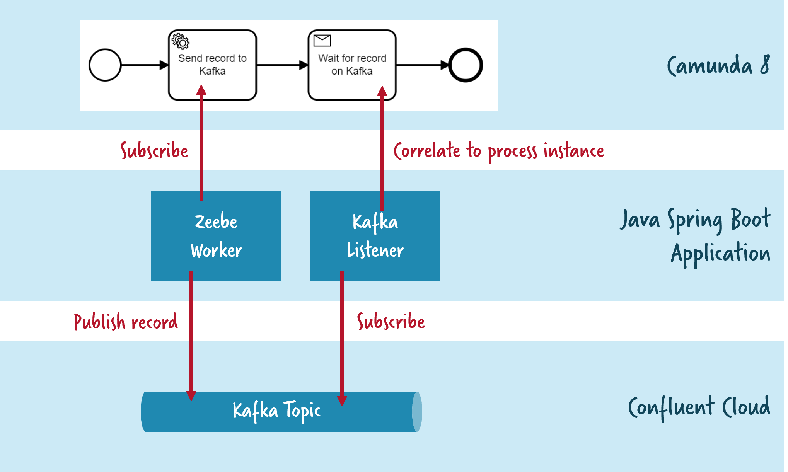

# Confluent Cloud (Apache Kafka) + Camunda Platform 8 (Zeebe) 

## Sample Glue Code Written in Java Spring Boot

Simple example code connecting Confluent Cloud (Kafka) and Camunda Platform 8 SaaS (Zeebe) by leveraging the Java Spring Boot integrations of both frameworks.

The example automates a very simple process, that

- writes a record to Kafka
- listens to the exact same record to correlate it back to the process instance

You can find a walk through on YouTube here:

